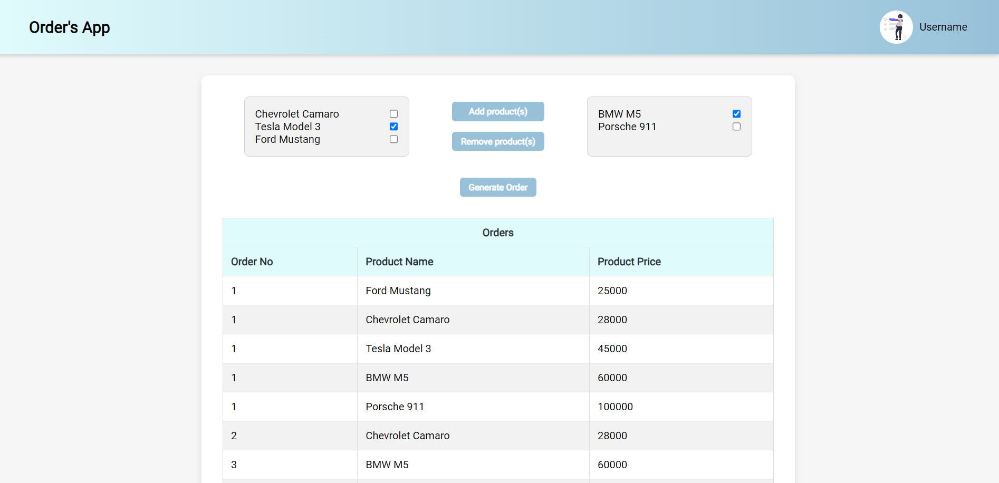

# Orders App

Hi! This is my project to develop an application to add orders using Java 21, Spring Boot 3.3.3, Thymeleaf to graphic interface, PostgreSQL 15, and Flyway for migrations.

## Installation

To install and run the project locally, follow these steps:

1. Clone the repository:

```bash
   git clone <URL_DEL_REPOSITORIO>
```

2. Open the project in IntelliJ IDEA by loading the pom.xml file and wait for Maven dependencies to load.

3. Open Docker Desktop or you can use directly PostgreSQL 15.8.

4. If you use Docker Open the terminal in the project directory and run the following command to set up PostgreSQL 15.8:

```bash
    docker run --name orders-app -e POSTGRES_USER=postgres -e POSTGRES_PASSWORD=postgres -e POSTGRES_DB=orders-app -p 5432:5432 -d postgres:15.8
```

5. Run the project by clicking the run button on the main application file.

6. Open your browser at http://localhost:8080/.

* It is recommended to use pgAdmin4 to visualize the changes in the database.
* If you want see the API Documentation, you can go this http://localhost:8080/swagger-ui/index.html#/ url


## Main Features

#### Epic: UI Development for Orders Management
* [x] Create a user interface (UI) that interacts with the backend using repositories and services, allowing users to add products to an order.

#### Epic: Creation of an API in Java
* [x] Develop an API with a one-to-many relationship between Orders and Products, where each Order has a composite primary key (PK) consisting of two different IDs.

#### Epic: Migration with Flyway
* [x] Create the database tables using migrations.
* [x] Add products to the database using Flyway migrations.


## Technologies Used

- **Java 21**: A modern, high-performance programming language used for backend development.
- **Spring Boot 3.3.3**: A powerful framework for building RESTful APIs and web applications in Java.
- **Thymeleaf**: A Java-based templating engine for rendering dynamic HTML pages in Spring Boot applications.
- **PostgreSQL 15**: A powerful, open-source object-relational database system used for data storage and management.
- **Flyway**: A database migration tool that helps manage and version database schemas.
- **Swagger**: A tool for documenting RESTful APIs. It provides an interactive UI to explore and test API endpoints. 
- **Lombok**: A Java library that helps reduce boilerplate code by providing annotations to automatically generate getters, setters, constructors, and more.
- **HTML**: The standard markup language for creating web pages.
- **CSS**: A stylesheet language used for describing the presentation of a document written in HTML.
- **JavaScript**: A scripting language used to create and control dynamic website content.
